# Building my DevOps Portfolio 🚀

## Project 8: Continuous Delivery on AWS Cloud 

One of the benefits of working at EY is Udemy for Business. I enrolled in the DevOps Projects | 20 Real-Time DevOps Projects course to enhance my DevOps portfolio and I’m sharing this process for educational purposes.
Thanks Rox for giving me the free credits to keep using AWS to develop this project! Thanks for your support to the DevOps Community worldwide. 

### Scenario
- ✅Product Development Team
- ✅Developers make regular code changes.
- ✅Package / Software / Artifact Deployment on server.
- ✅Software testing / interaction testing after deployment

### Problem
- ❌In an Agile SDLC, there will be frequent code change.
- ❌ Manual code deployment is time consuming
- ❌ Developers and testers not equipped with Ops knowledge
- ❌ Need to hire Ops or outsource professionals
- ❌ Dependency on Ops team
- ❌ CI / CD Server maintenance
- ❌ Operational overhead to maintain server like Jenkins Nexus, Sonar, Git, QA Server for testing

### Solution: Continuous Delivery Process on Cloud
- ✅ PAAS and SAAS Cloud Services
- ✅ Disposable Environment
- ✅ Automate CI/ CD Process
- ✅Build, Test, Deploy and test for every commit.

### Benefits CD Pipeline
- ✅ Short Mean time to recovery (MTTR).
- ✅ Agile.
- ✅ No operational.
- ✅ No human intervention.
- ✅ Fault isolation.

### AWS Services
- 🟠 Code commit (VCS)
- 🟠 Code artifact (Maven repo for dependencies)
- 🟠 Code build (Build service from AWS)
- 🟠 Sonarcloud (Sonarqube cloud based tool)
- 🟠 Checkstyle (Code analysis from build jobs)
- 🟠 Selenium - Software testing (Code build and others)
- 🟠 Beanstalk (For hosting application)
- 🟠 RDS (Database for application service)
🟠Codepipeline (Service to integrate al jobs together)

### COMPARISON with previous project (CD using jenkins and tools)
- 🟠 AWS Code Commit		🛠️ Github
- 🟠 AWS Code Artifact		🛠️ Nexus Sonartype
- 🟠 AWS Code Build	    	🛠️ Jenkins Jobs
- 🟠 Sonar Cloud		    🛠️ Sonarqube Server
- 🟠 AWS Code Pipeline    	🛠️ Jenkins Pipeline
- 🟠 AWS Beanstalk   		🛠️ Tomcat VM
- 🟠 AWS RDS		    	🛠️ MySQL on VM

Steps
- ⏭️Login to AWS Account.
- ⏭️Code commit
- ⏭️Create codercommit repo
- ⏭️Sync it with local repository

- ⏭️Code artifact
- 	⏭️Create  repository
- 	⏭️ Update settings.xml file in source code top level directory
- 	⏭️ Update pom.xml file with repo details
- 	⏭️ Generate token and store in SSM Parameter store

- ⏭️ Sonar Setup
- 	⏭️Create sonar cloud account
- 	⏭️ Generate token and store in SSM Parameter store
- 	⏭️ Create Build Project
- 	⏭️ Update codebuild role to access SSM Parameter store

- ⏭️ Create notifications for SNS

- ⏭️ Build Project
- 	⏭️ Create variables in SSM Parameter store
- 	⏭️ Create build project

- ⏭️ Create pipeline
- 	⏭️ Codecommit
- 	⏭️ Testcode
- 	⏭️ Build
- 	⏭️ Deploy to S3 Bucket

- ⏭️ Create Beanstalk & RDS
- ⏭️ Update RDS security group
- ⏭️ Deploy DB in RDS
- ⏭️ Switch to cd-aws branch
- ⏭️ Update settings.xml & pom.xml
- ⏭️ Create another build job to create artifact with buildspec file in cd-aws
- ⏭️ Create a deploy jov to beanstalk
- ⏭️ Create a build job for software testing
- ⏭️ Upload screenshot to S3 bucket
- ⏭️ Update Pipeline
-	⏭️Codecommit
-	⏭️Testcode
-	⏭️Build
-	⏭️Deploy to S3 Bucket
-	⏭️Build and release
-	⏭️Deploy to beanstalk
-	⏭️Build job for selenium test scripts
-	⏭️Upload result to S3
	

## CD on AWS
- AWS Diagram
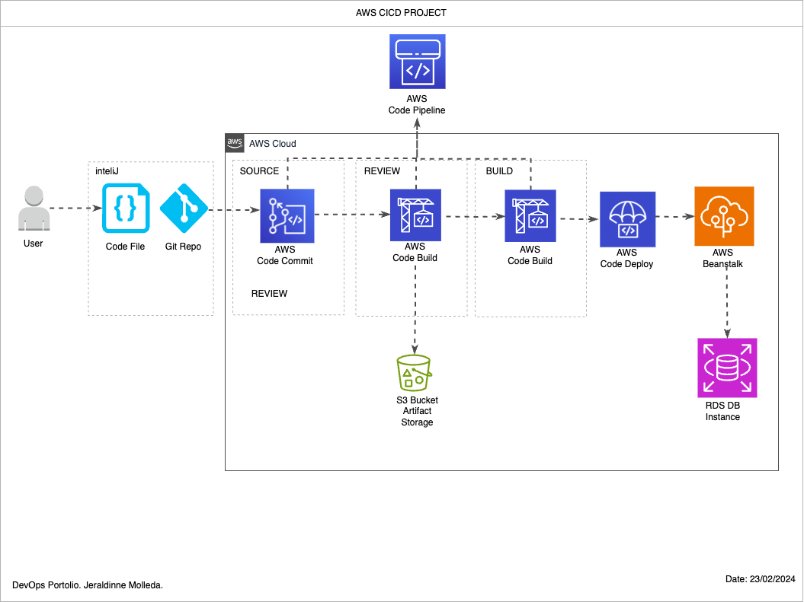
- AWS CodeBuild

- AWS RDS
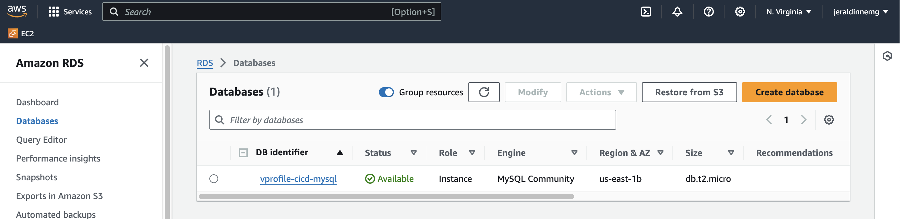
- AWS Code Pipeline
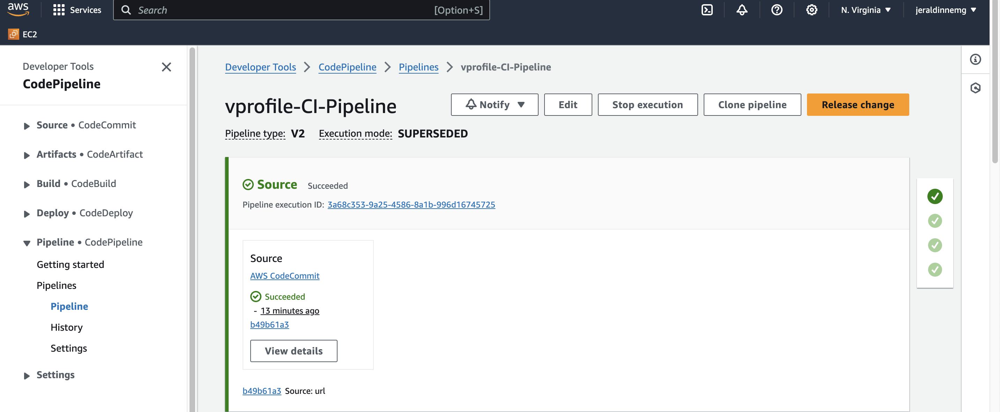
- AWS Code Pipeline
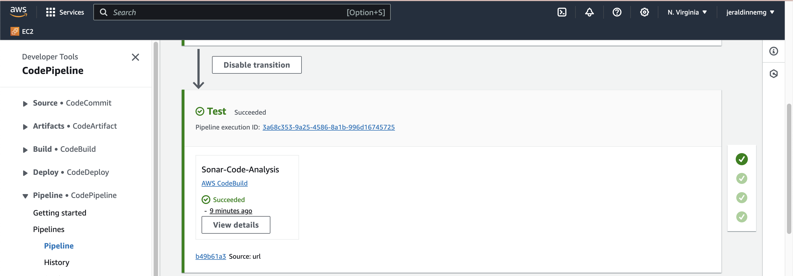
- AWS Code Pipeline
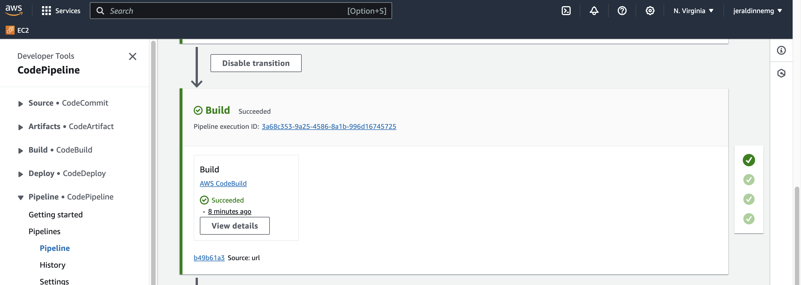
- AWS Code Pipeline
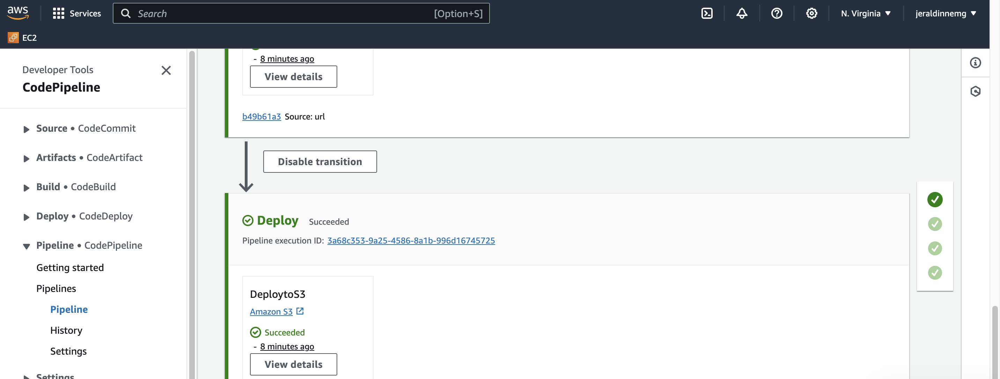
- AWS Elastic Beanstalk Service
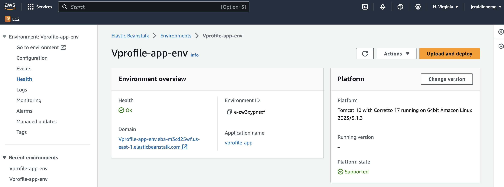
- EB EC2-instances
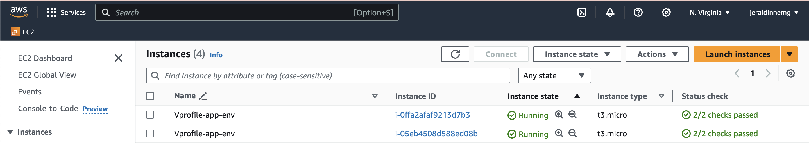
- EB Load Balancer
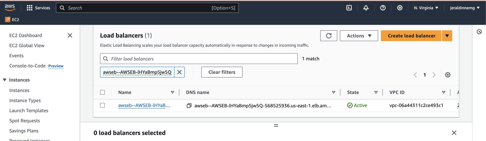
- SSH EB Launched
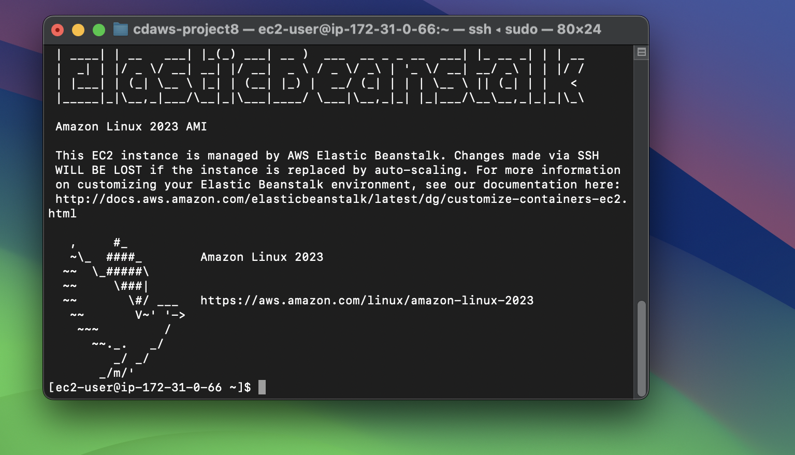
- SonarCloud
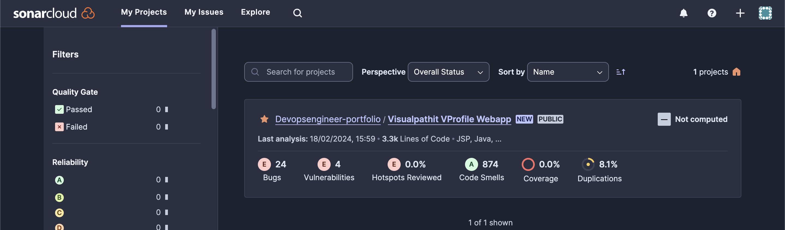
- SonarQualityGate
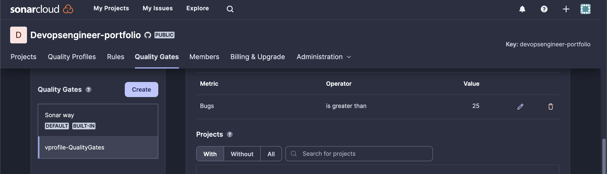
- S3 Bucket
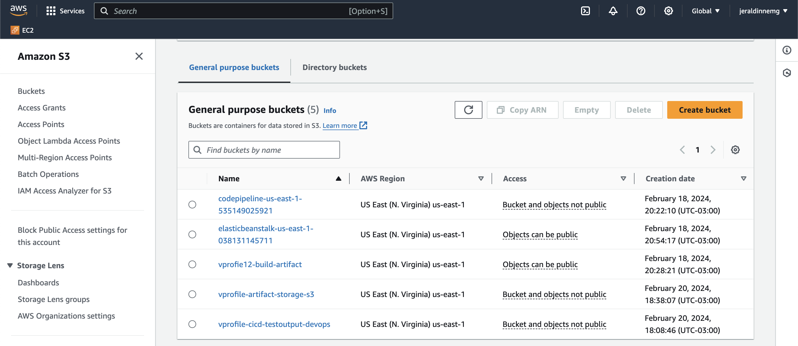
- AWS SNS
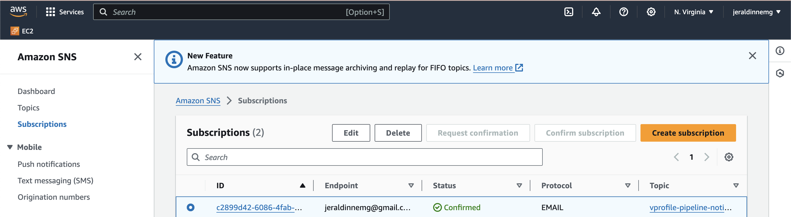
- AWS SNS subs
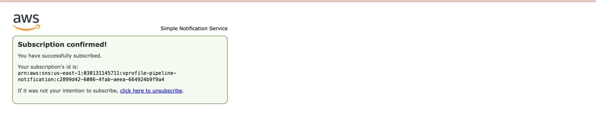
- Vprofile deploy
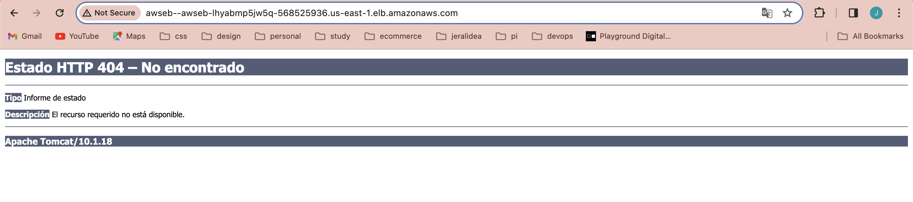